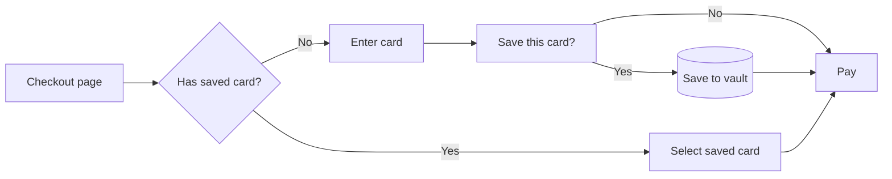

## Goal

Returning customers currently re-enter card details on every purchase,
adding ~25 seconds and ~8% drop-off at the payment step. We want signed-in
users to save and reuse cards in checkout, reducing time-to-purchase and
recovering some of the drop-off.

## Success metrics

- metric: percent_of_checkouts_using_saved_card
  eventName: checkout_completed
  property: payment_method_source
  target: ">= 30% of signed-in checkouts within 28 days"
  window: 28d

- metric: checkout_time_p50
  eventName: checkout_completed
  property: duration_ms
  target: "p50 reduction of >= 8s vs pre-launch baseline"
  window: 28d

## Behaviors

### B1. User saves a card during checkout

- platforms: [web, ios]
- instrumentation:
    eventName: payment_method_added
    properties: [source, card_brand, user_id_hashed]
    expectedRatePerDay: 200
- perfBudget:
    ttiMs: 1500
    p95LatencyMs: 800
    errorRatePct: 0.5
- commsStates:
    empty: "Save this card for next time"
    loading: "Saving your card..."
    success: "Card saved. You'll see it next time you checkout."
    error: "We couldn't save that. You can still complete this purchase, then try again from Account → Payment methods."

### B2. User selects a saved card at checkout

- platforms: [web, ios]
- instrumentation:
    eventName: payment_method_used
    properties: [source, card_brand]
    expectedRatePerDay: 150
- perfBudget:
    ttiMs: 1000
    p95LatencyMs: 400
    errorRatePct: 0.5
- commsStates:
    empty: "No saved cards yet — add one below"
    loading: "Loading your saved cards..."
    success: "Card selected"
    error: "We couldn't load your saved cards. You can pay with a new card below."

### B3. User removes a saved card from account settings

- platforms: [web, ios]
- instrumentation:
    eventName: payment_method_removed
    properties: [card_brand]
    expectedRatePerDay: 20
- perfBudget:
    ttiMs: 1000
    p95LatencyMs: 500
    errorRatePct: 0.5
- commsStates:
    empty: "You don't have any saved cards yet."
    loading: "Removing card..."
    success: "Card removed."
    error: "We couldn't remove that card. Please try again."

## Acceptance criteria

- AC1 (B1): Given a signed-in user on the checkout page with no saved
  cards, when they enter card details and check "Save this card", then
  a `payment_method_added` event fires with `source="checkout"` and the
  card appears on the next visit to /account/payment-methods.

- AC2 (B2): Given a signed-in user on the checkout page with at least
  one saved card, when the page loads, then the saved card(s) appear
  above the "add new card" form, and selecting one fires a
  `payment_method_used` event with `source="checkout"`.

- AC3 (B3): Given a signed-in user on /account/payment-methods with at
  least one saved card, when they tap "Remove" on a card and confirm,
  then a `payment_method_removed` event fires and the card disappears
  from the list.

- AC4 (B1): Given a saved-cards rollout is at 0%, when a signed-in user
  opens checkout, then no saved-cards UI appears and the flow matches the
  pre-launch baseline. (Regression test.)

## Diagrams

## Out of scope

- Multiple-card management UI beyond add/remove (no nicknames, no
  default-card flag).
- Apple Pay / Google Pay integration.
- Saved cards in subscription billing flows.
- Adding cards outside of checkout (e.g., empty-state "Add card" from
  account settings).

## Open questions

(All resolved at verification.)

## Verification summary

- Readiness: verified
- Confidence: 0.86
- Sized: medium — 2 platforms in scope, additive schema (new
  `saved_payment_methods` table with no migration on existing tables).
- 0 open blockers, 0 open warnings, 4 resolved info findings.
