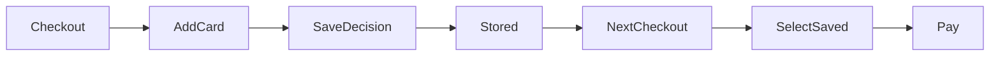

# Contract format

A contract is a markdown file at `.shipline/contracts/<ID>.md` with YAML
frontmatter and structured sections. The format is designed to be both
human-readable and machine-parseable.

## Minimal template

```markdown
---
id: SC-001
title: Saved payment methods on web and iOS
status: draft               # draft | verifying | verified | promoted
complexity: null            # set by critic-sizing: small | medium | large
platforms: [web, ios]
createdBy: pawan@example.com
revision: 1

# Cycle-time timestamps — each stamped by the skill that triggers the
# transition. The Launch Report computes total cycle time from these.
createdAt: 2026-05-19T09:00:00Z        # /contract new
verifiedAt: null                        # readiness gate goes green
promotedAt: null                        # /contract promote (SLA timer starts here)
slaDeadline: null                       # promotedAt + 24h or 72h
prOpenedAt: null                        # implement skill opens PR
prMergedAt: null                        # PR merged to main
qaDeployedAt: null                      # successful deploy to QA env
canaryStartedAt: null                   # 1% rollout begins
prodRollout100At: null                  # feature flag hits 100%
landedAt: null                          # day-28 verdict committed
landed: null                            # true | false | partial | rolled-back
slaHit: null                            # promotedAt → prodRollout100At within SLA?
---

## Goal

One paragraph. What problem does this solve, for whom, why now?

## Success metrics

- metric: percent_of_checkouts_using_saved_card
  eventName: checkout_completed
  property: payment_method_source
  target: ">= 30% within 28 days"
  window: 28d

## Behaviors

### B1. User adds a card during checkout
- platforms: [web, ios]
- instrumentation:
    eventName: payment_method_added
    properties: [source, card_brand]
    expectedRatePerDay: 200
- perfBudget:
    ttiMs: 1500
    p95LatencyMs: 800
    errorRatePct: 0.5
- commsStates:
    empty: "No saved cards yet"
    loading: "Saving your card..."
    success: "Card saved. You'll see it next time."
    error: "We couldn't save that. Try again or use a different card."

### B2. User selects a saved card at checkout
- ...

## Acceptance criteria

Each AC MUST declare which behavior it covers, using `(B<n>)` right
after the AC id. The deterministic validator uses this to verify that
every behavior has at least one AC — without explicit linkage it can't
check coverage. One AC can cover multiple behaviors: `AC1 (B1, B2):`.

- AC1 (B1): Given a logged-in user with no saved cards, when they complete
  checkout and check "Save this card", then a payment_method_added event
  fires with source="checkout" and the card appears on /account/payment-methods.
- AC2 (B2): ...

## Diagrams



## Out of scope

Explicitly list what this does NOT include, so reviewers don't add scope.

## Open questions

Things the author needs answered before promote. Critics will flag these.
```

## Field reference

### Frontmatter

| Field | Required | Notes |
|---|---|---|
| `id` | yes | Short stable ID. Prefix by epic area (SC, AUTH, etc.) |
| `title` | yes | One line |
| `status` | yes | State machine: draft → verifying → verified → promoted |
| `complexity` | set by the validator | small / medium / large |
| `platforms` | yes | Subset of [web, ios, android, server, email] |
| `revision` | yes | Bumps on every promoted edit |
| `type` | no | `epic` for a decomposed Large contract; omitted otherwise |
| `parent` | no | On a child: the epic ID it belongs to |
| `children` | no | On an epic: ordered list of child contract IDs |
| `dependsOn` | no | On a child: child IDs that must ship first |
| `implementation` | no | `agent` (default) or `human-led` (migrations/auth — speced + verified by Shipline, human writes the code) |
| `slackThreadTs` | set on promote | Slack `thread_ts` of the contract's anchor message; later updates reply in this thread |
| `slackChannel` | set on promote | The channel the thread lives in (default `#shipline`) |
| `owner` | set at intake | Who owns this contract (email/handle) |
| `lockedBy` | advisory | Who is actively working it right now; set on verify/implement, cleared on completion |
| `lockedAt` | advisory | ISO time the lock was taken (a lock older than ~2h is treated as stale) |

### Central state — where contracts live

Contracts are the source of truth, so they need ONE home. For a
multi-repo product, that home is a **dedicated specs repo** (e.g.
`your-org/shipline-contracts`) on a single `main` branch — not the
`.shipline/` of any one code repo. Git gives a total commit order on
one branch, so that repo *is* a consistent central store: no two devs
get diverging findings for the same contract. Code PRs in the product
repos reference the contract by ID; they don't carry contract state.
`/status` run in the specs repo is the live dashboard.

The `owner` / `lockedBy` / `lockedAt` fields are an **advisory** layer
on top: they help teammates avoid stepping on each other, but they're
only meaningful in the single-branch specs-repo model (a lock in a
git file across divergent branches diverges like anything else). They
warn, they don't hard-block — git remains the real arbiter.

A real-time, concurrent-edit-locked central *service* (Firestore/
Postgres + API) is the v2+ upgrade if single-branch git ever causes
real friction; the plugin is deliberately built so that service would
wrap the same contract format rather than replace it.

### Large contracts → epics

A `large` contract is not refused. `/contract decompose <ID>` turns it
into an **epic** (`type: epic`) whose `children` are dependency-ordered
Small/Medium contracts. The epic owns the overall success metric
(measured across all children); each child is a normal contract with
`parent` set, verified and promoted in order. Risky children
(migrations, auth) carry `implementation: human-led`. The validator
skips behavior-level checks on an epic (its behaviors live in the
children). See the `contract-decompose` skill.

### Cycle-time timestamps

Every transition stamps a timestamp. The Launch Report computes total
cycle time and per-phase durations from these. Each stamp is set by
the skill or workflow that triggers the transition:

| Field | Set by | Captures |
|---|---|---|
| `createdAt` | `contract-new` | When intake started |
| `verifiedAt` | `contract-verify` | When readiness went green |
| `promotedAt` | `contract-promote` | When SLA timer started |
| `slaDeadline` | `contract-promote` | promotedAt + 24h (small) or 72h (medium) |
| `prOpenedAt` | `implement` | When the Implementer opened the PR |
| `prMergedAt` | `verify-pr` (on merge) | When the PR merged to main |
| `qaDeployedAt` | `verify-deployment` | When QA deploy succeeded |
| `canaryStartedAt` | `verify-deployment` | When 1% rollout began |
| `prodRollout100At` | `verify-deployment` | When flag hit 100% |
| `landedAt` | `launch-report` | When day-28 verdict committed |
| `landed` | `launch-report` | Final verdict |
| `slaHit` | `launch-report` | Did promotedAt → prodRollout100At fit the SLA? |

The Launch Report includes a cycle-time section per day surfacing:
- **Total intake → prod**: createdAt → prodRollout100At
- **Promoted → prod**: promotedAt → prodRollout100At (the SLA window)
- **Per-phase**: time in each phase (spec / build / ship / land)

Track these across many contracts and you get a real distribution of
your team's actual cycle time — which is more valuable than any
single SLA promise.

### Slack threading — one channel, no spam (convention)

All Shipline updates post to ONE channel (`#shipline` by default), but
they DON'T flood it. Each contract gets exactly **one top-level
message** (the promotion announcement); every later update — implement
done, verify verdict, canary approval, launch reports day 1/7/14/28,
bug triage — posts as a **threaded reply** under it.

The mechanism: `contract-promote` posts the anchor message and records
its Slack `thread_ts` on the contract:

```yaml
slackThreadTs: "1716192000.123456"   # set by contract-promote
slackChannel: "#shipline"            # the channel the thread lives in
```

Every later skill that posts (implement, verify-deploy, launch-report,
bug-triage) posts with `thread_ts: <slackThreadTs>` so it lands in the
thread, not the channel. Result: the channel shows one line per
contract; click in to see its whole history.

**Exception — urgent alerts.** SLA overdue, a `rollback` verdict, or a
canary auto-pause ALSO post a brief top-level alert that links back to
the thread, so genuinely urgent things aren't buried. Everything else
stays threaded.

### SLA countdown in every update (convention)

Every status update during the build/ship phases — PR comments,
Slack messages, command output — leads with the current SLA line so
the dev always knows where they stand. Get it deterministically:

```bash
node <plugin-root>/scripts/validate.mjs --sla .shipline/contracts/<ID>.md
```

It prints one of:
- `⏳ SLA: 18h 20m left (due <time>)` — on track
- `⏳⚠️ SLA: 3h 10m left (due <time>)` — under 20% of the window left
- `⚠️ SLA OVERDUE by 2h 5m (was due <time>)` — past deadline (exit 1)
- `SLA: not started (promote to start the timer)` — pre-promote

The implement, verify-pr, verify-deploy, and promote skills all
prepend this line. The countdown resolves once the feature hits 100%
prod (then `slaHit` records the final hit/miss).

### Behavior fields

Each behavior needs `instrumentation`, `perfBudget`, and `commsStates` for the
contract to reach `verified` status. The instrumentation-coverage,
perf-budget, and comms-completeness critics enforce this.

### Sizing rules (set by critic-sizing)

| Bucket | Rules |
|---|---|
| **small** | 1 platform, ≤3 behaviors, no schema, no auth, flag-gated |
| **medium** | ≤2 platforms, ≤8 behaviors, additive schema OK, existing vendors |
| **large** | Anything else — exits the pipeline |

## Findings file

Verification produces `.shipline/contracts/<ID>.findings.md`:

```markdown
---
contractId: SC-001
verifiedAt: 2026-05-19T10:00:00Z
verifiedRevision: 1
readiness: review_needed
confidenceScore: 0.78
---

## Open blockers (0)

(none)

## Warnings (2)

### W1 [instrumentation-coverage] B3 has no instrumentation field
Suggestion: add an event for "user removes saved card", at least `payment_method_removed`.
Status: open

### W2 [platform-parity] B2 only describes web behavior
Suggestion: clarify iOS interaction (modal vs full screen).
Status: open

## Info (5)
...
```
